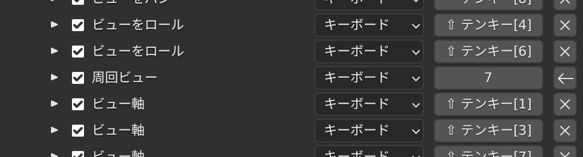
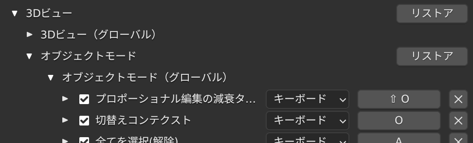
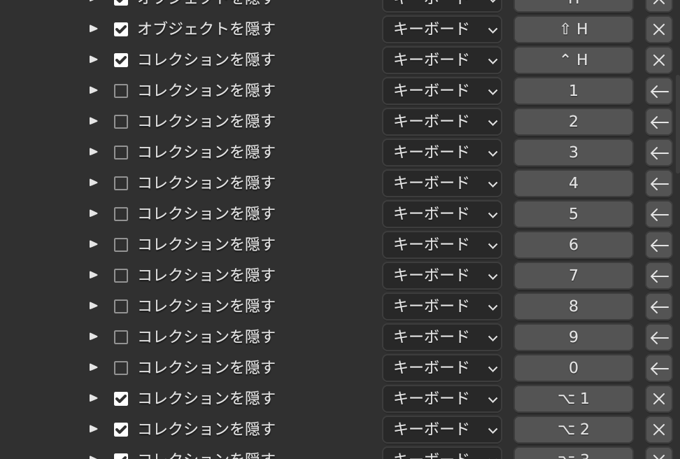
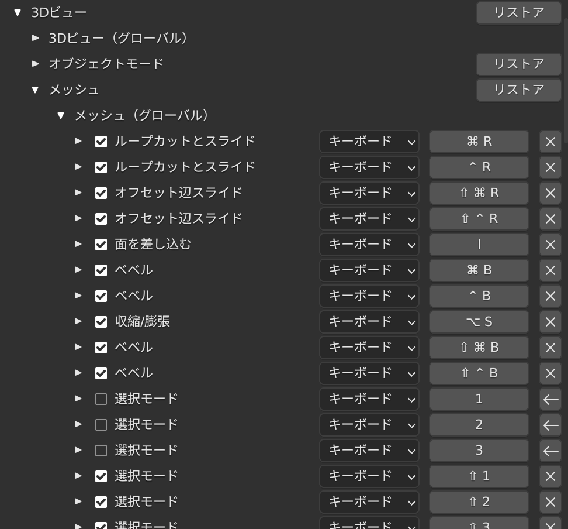
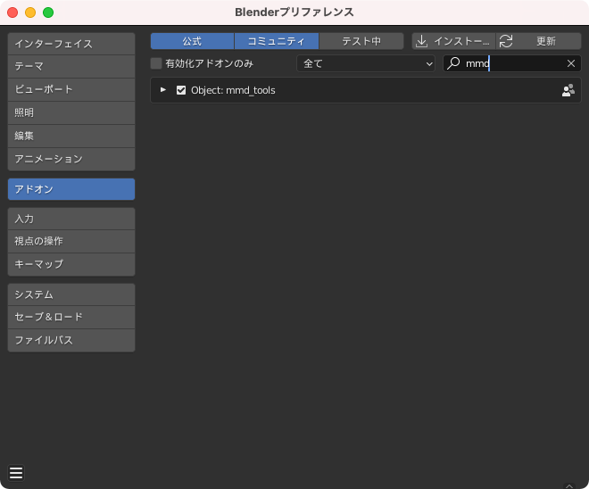
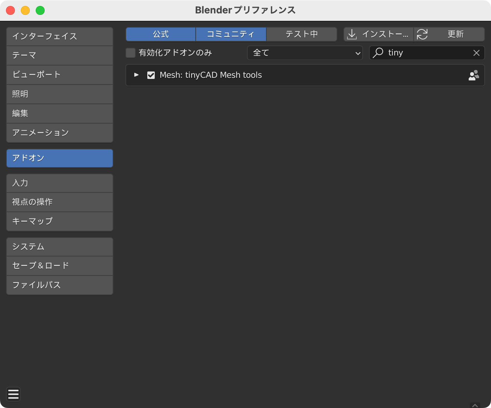
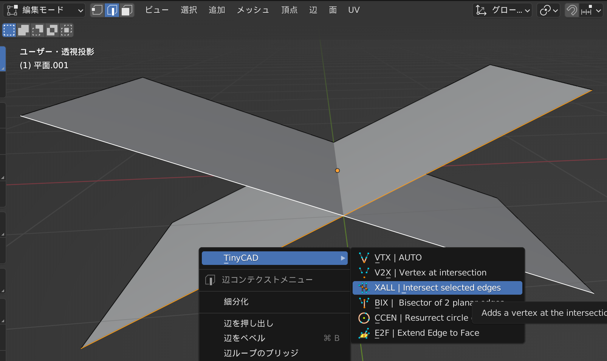

# Blender の設定

## 採用バージョン

3.1.2 Apple Sillicon

採用理由：常に最新をキャッチアップしたい。多少のバグは許容する

## キーバインド

[編集] > [プリファレンス] > [キーマップ] > [キーバインド]

Blender 3.5.1

3Dビュー > 3D View (Global)

3Dビュー > オブジェクトモード

3Dビュー > メッシュ

## アドオン

[編集] > [プリファレンス] > [アドオン]

### Object: mmd_tools

MMD モデルを読み込めるようにするためのアドオン

元は原神の無料配布モデルがpmxファイルだったのでそれを読み込むためにインストールした

#### 導入

1. [https://github.com/UuuNyaa/blender\_mmd\_tools/releases/tag/v2.5.1](https://github.com/UuuNyaa/blender_mmd_tools/releases/tag/v2.5.1) より zip をダウンロードする

（v2.5.1 は当時の最新。最新を確認してダウンロードすること）

2. ファイルを怪盗する

3. フォルダの中にある「mmd_tools」フォルダを、「Blenderフォルダ」→「scripts」→「addons」の中に移動する

`open /Applications/Blender.app/Contents/Resources/3.1/scripts/addons/` でアドオンフォルダを開き突っ込む

[編集] > [プリファレンス] を開き、[アドオン] タブから検索で mmd_tools にチェックが入っていることを確認して完了

4. [ファイル] > [インポート] から MikuMikuDance Model でインポートできるようになる

### Mesh: tinyCAD Mesh tools

直線の交点に頂点を作るためのアドオン

人モデリング時には使わないが、無機物のモデリングで左右対称さを実現したい際に使うことが多々ある

#### 導入

[編集] > [プリファレンス] を開き、[アドオン] タブから検索で tiny で検索してチェックを入れる

#### 使い方

事前に交差する辺は一つのオブジェクトに統合しておく

オブジェクトを選択し、[編集モード] から選択モードを [辺] にして交差する2つの辺を Shift を使って選択する

[W] を押して辺コンテクストメニューに追加されていることを確認し、その中の [XALL | Intersect selected edges] を選択すれば交点を作れる

※ただし、交点作成後、辺の両端の頂点が重複して作られる場合があるため、頂点が重複していないか要確認！！

# おまけ

[HowTo](./HOW_TO.md)
