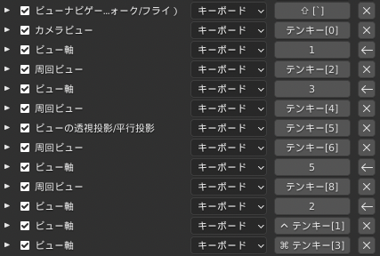
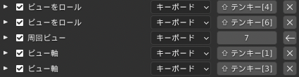
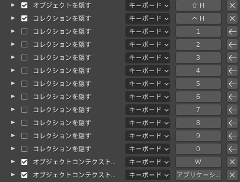
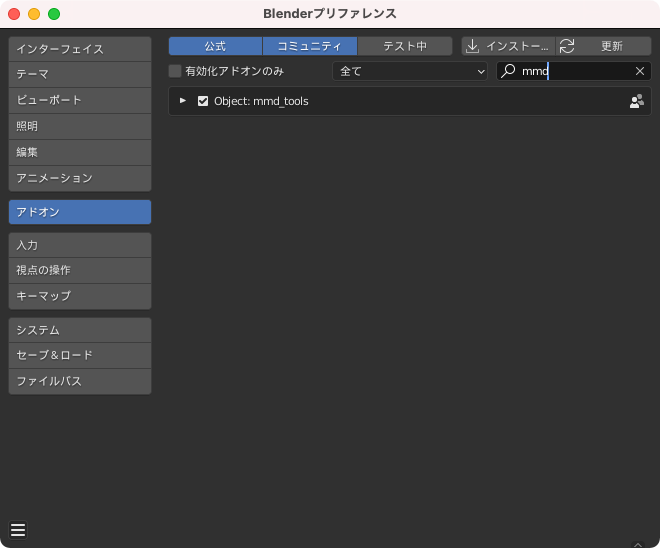
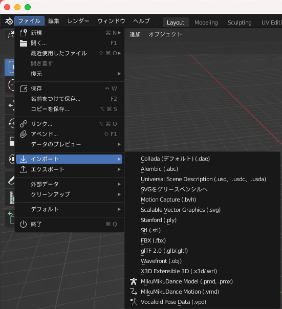

# Blender の設定

## 採用バージョン

3.1.2 Apple Sillicon

採用理由：常に最新をキャッチアップしたい。多少のバグは許容する

## キーバインド

[編集] > [プリファレンス] > [キーマップ] > [キーバインド]

Blender 27X

3Dビュー > 3D View (Global)

少し下にスクロールして

3Dビュー > オブジェクトモード

## アドオン

[編集] > [プリファレンス] > [アドオン]

### Object: mmd_tools

MMD モデルを読み込めるようにするためのアドオン

元は原神の無料配布モデルがpmxファイルだったのでそれを読み込むためにインストールした

#### 導入

1. [https://github.com/UuuNyaa/blender\_mmd\_tools/releases/tag/v2.5.1](https://github.com/UuuNyaa/blender_mmd_tools/releases/tag/v2.5.1) より zip をダウンロードする

（v2.5.1 は当時の最新。最新を確認してダウンロードすること）

2. ファイルを怪盗する

3. フォルダの中にある「mmd_tools」フォルダを、「Blenderフォルダ」→「scripts」→「addons」の中に移動する

`open /Applications/Blender.app/Contents/Resources/3.1/scripts/addons/` でアドオンフォルダを開き突っ込む

[編集] > [プリファレンス] を開き、[アドオン] タブから検索で mmd_tools にチェックが入っていることを確認して完了

4. [ファイル] > [インポート] から MikuMikuDance Model でインポートできるようになる

# おまけ

[HowTo](./HOW_TO.md)
