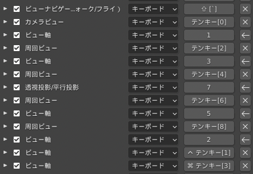

# Blender の設定

## 採用バージョン

3.1.2 Apple Sillicon

採用理由：常に最新をキャッチアップしたい。多少のバグは許容する

## キーバインド

[編集] > [プリファレンス] > [キーマップ] > [キーバインド]

Blender 27X

3Dビュー > 3D View (Global)

3Dビュー > オブジェクトモード

## アドオン

[編集] > [プリファレンス] > [アドオン]

### Object: mmd_tools

MMD モデルを読み込めるようにするためのアドオン

詳しくはこちらから導入を

https://github.com/sugiany/blender_mmd_tools

